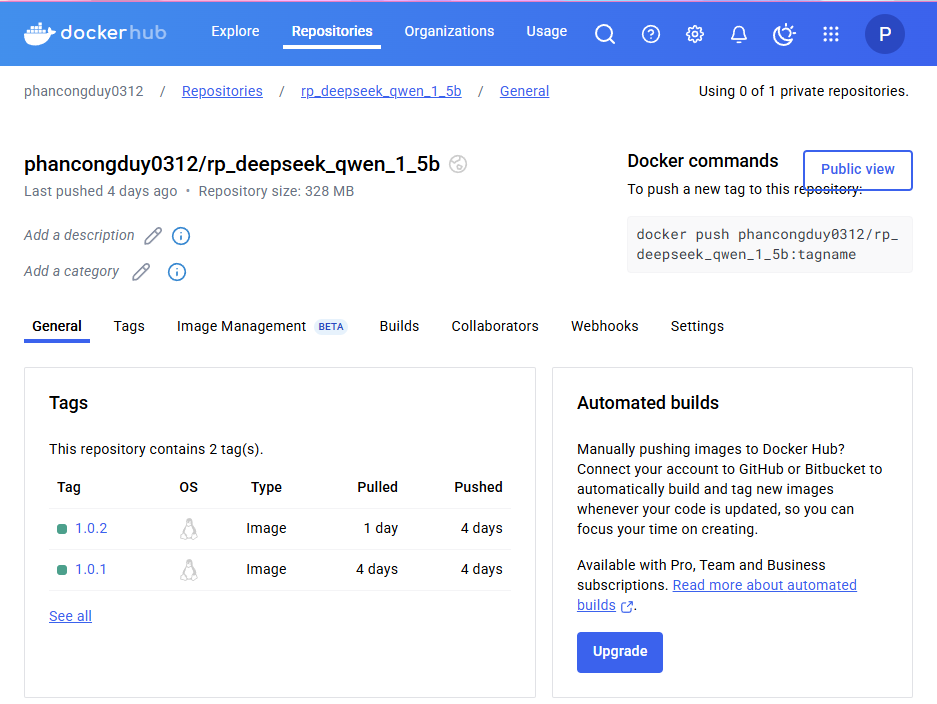
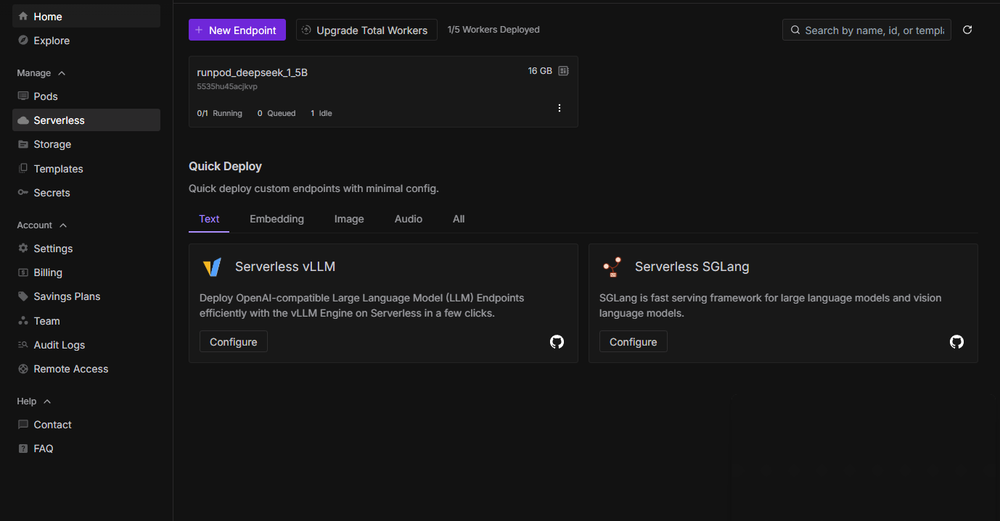
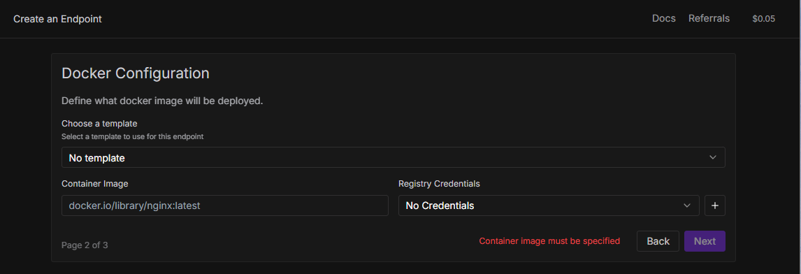
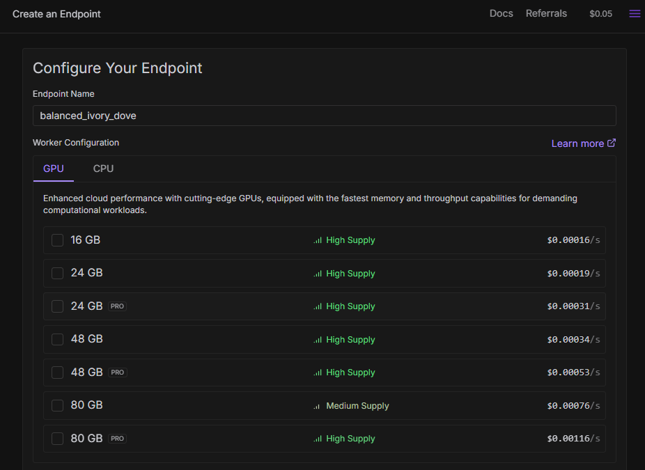
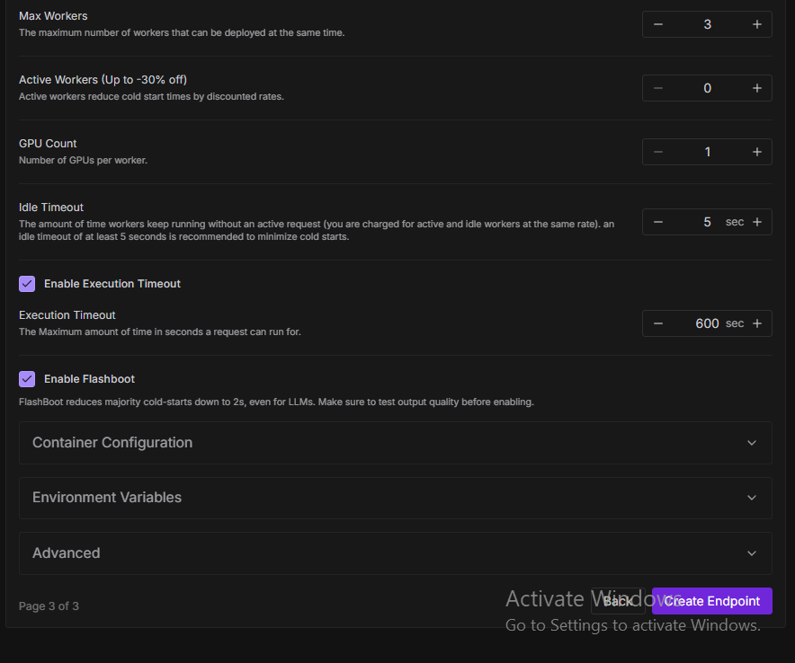

# runpod_deepseek_qwen_1_5b
- Pre-requirements:
    - Docker installed, Docker Hub account
    - Runpod accounnt
- And then clone this repository:
```
git clone https://github.com/PhanCongDuy312/runpod_deepseek_qwen_1_5b.git
cd runpod_deepseek_qwen_1_5b
```
### Step 1. Build Docker Image
```
cd deploy_runpod
```
Runpod serverless endpoint will base on your docker image as the working environment
#### Build step:
```
docker login
```
- username is your dockerhub's username
- password is your access token. To get access token, you login to your dockerhub
```
docker build . --file Dockerfile --tag <username>/runpod_deepseek_qwen_1_5b:latest
```
- Change the <username> in the above running script by your dockerhub'username.
#### Push to Docker Hub
```
docker push <username>/runpod_deepseek_qwen_1_5b:latest
```
- Change the <username> in the above running script by your dockerhub'username.
#### Check your hub for push success or not

### Step 2. Create Serverless Runpod Endpoint
- In your Runpod website, choose Serverless -> New Endpoint

- Choose Docker Image -> Next

- At Container Image, pass your docker image that you have just pushed to dockerhub -> Next
- For me that is "phancongduy0312/rp_deepseek_qwen_1_5b:1.0.2"
- REMEMBER ALSO PUT THE TAG OF THE IMAGE TOO

- Pick 1 or more GPU(s) that you think you gonna use when you run your model

#### With this repo, you just need to choose ONE 16GB only
- With the other config:
    - MAX WORKERS : Set to 1, because we use for testing only, not for deploy to user or something that we have to handle a lot of user.
    - ACTIVE WORKERS : Set to 0, same reason.
    - GPU COUNT : Number of GPUs for each worker, set it as default is 1.
    - The others just leave it.
<br><br>


### Finally, press Create Endpoint

## For testing / inference
### Step 1: Create env, use Conda.
```
cd ..
conda create -n runpod_deepseek_1_5b python=3.10
conda activate runpod_deepseek_1_5b
pip install -r requirements.txt
```
### Step 2: Run infer.py
```
python infer.py
```
